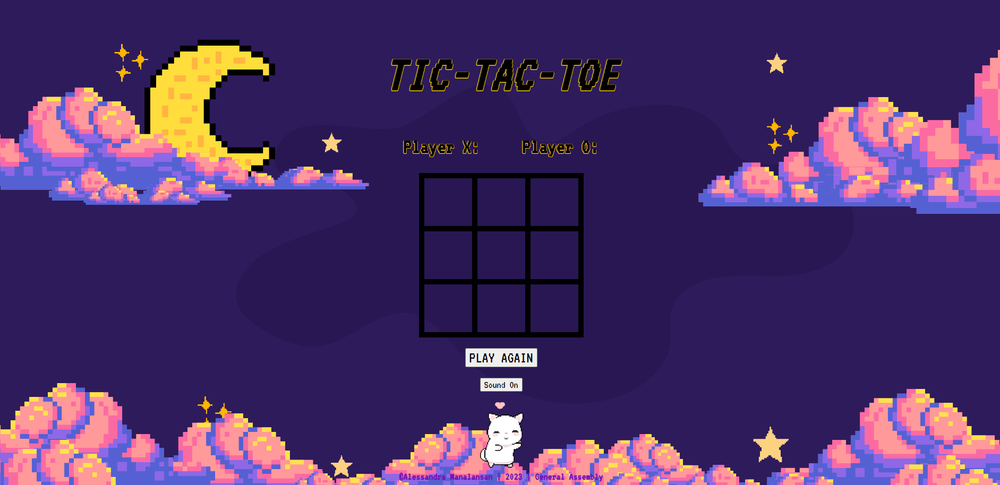
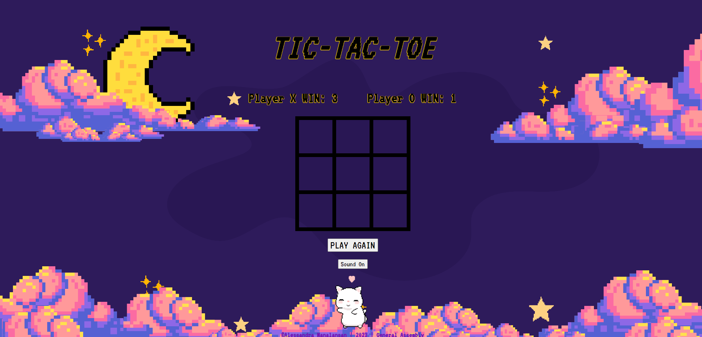
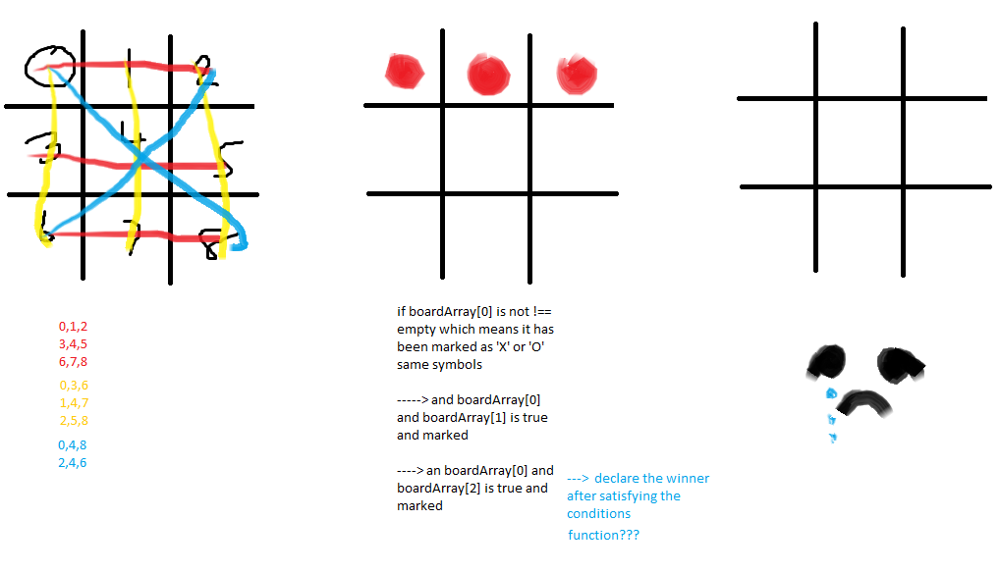

<h1 align='center'>TICTACTOE | Project 1 𝗫𝗢 </h1>

Project Description

╰┈➤ Hello and welcome to my very first project!
To play my version of TIC TAC TOE, please visit the link provided below. 

In addition, I will quickly describe the development approach I followed to make the game.

HAPPY PLAYING!

 ## Link: https://alesmnlnsan.github.io/Tic-Tac-Toe/

 ## HOW TO PLAY:
> 1. Click on the link to start a tic-tac-toe game. 

> 2. As soon as you click on the grid, the player markers for all of the players are immediately established. At the beginning of each new round, the first player starts at the 'X' position. The second player will take control after the following click, which will be the letter 'O'.

> 3. Each player can take turns making moves. Player X goes first, then Player O.

> 4. On each turn, click on the square where you wish your marker (X or O) to be placed. The programme will update the game board accordingly.

> 5. Take turns with your opponent until one of you wins or the game concludes in a draw.

> 6. The game programme will automatically determine if a player has won or if the game is a tie. A player wins the game if they can get three of their markers aligned in a row in any direction (horizontally, vertically, or diagonally). If all nine squares are filled with no winner, the game is a tie.

> 7. When a player wins or the game ends in a tie, the game programme displays the outcome on the player score tally and resets the board to play again. NOTE: A TIED GAME IS CONSIDERED AS <em>NO SCORE<em>

# [ADDITIONAL FEATURES]
>- If you want to start over without waiting for a win or a tie, you can use the "Play Again" button situated beneath the board.
>- At the bottom of the screen is a 'Sound' button that plays an 8-bit version of 'Zelda's Lullaby.'

## PREVIEW of the game:

# Initial Screen
</img>

# Game screen with scores
</img>

## List of technologies used:
- HTML
- CSS
- JavaScript

## DEVELOPMENT of the GAME
- To start this project, I devised a step-by-step strategy from start to finish. First, I developed the game's framework by making the necessary HTML and CSS files. Then, using JavaScript, I extended the game's capabilities. To win the game, I chose to examine the various winning combinations in Tic Tac Toe by visualising the board in an array of data using a paint programme. This has proven to be really useful for me in order to develop the primary component of my javascript file, which is the code to win the game!

</img>

- Throughout the development phase, I struggled a lot with designing the functions and aligning the page to be aesthetically appealing for players. Whenever I found myself in a difficult circumstance, I would resort to conducting my own research to assist me in overcoming the obstacle, and I would frequently refer back to my own notes and earlier coursework as a source of information. 

## List of IMPROVEMENTS
><em>New features have been added (not addressed in class) <em>
>- the only new feature is the audio feature. I was perusing the learning dashboard and the git page with sources and I added one as background music if the player wants to play tic tac toe to some soothing 8-bit Zelda tunes.

><em>The most difficult aspect<em> of the project was putting everything together. Constructing it from scratch and ensuring that all of its components functioned correctly required some work. I understood what I needed to accomplish, and I knew the tools and strategies to use, but it doesn't always work so as a result, it took a significant amount of effort on my part to construct it! 

><em>What was your favourite part of the project to work on? <em>
>- I'm not very good at navigating CSS grids and flexboxes, but I really enjoyed customising the page's appearance.

><em>What else would you like to add?<em>
>- Possibly more aesthetically pleasing features, such as in-game animations and sound effects. I'd also like to try playing against a computer opponent!
>- I would want to have a computer opponent so that the players can compete against the computer! 
>- It would be fun to have different choices such as Images instead of just 'X' and 'O'
>- I would like to have a message to highlight that the results are tied as well.

I WOULD VERY MUCH LIKE TO CONDENSE MY CODE FURTHER IN THE FUTURE!!!!
its 4AM *cries*